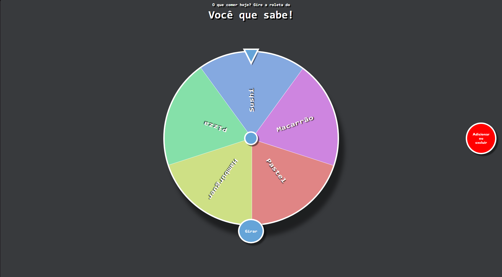

# Você Que Sabe!



Projeto interativo inspirado na clássica frase **“Você que sabe!”**, criado para ajudar indecisos (especialmente casais 😄) a escolherem **o que comer** de forma simples, rápida e bem-humorada.

O site apresenta uma **roleta online de comidas**, onde o usuário pode girar e deixar o destino decidir a refeição do dia.

---

## 🚀 Como usar

1. Acesse o site 🔗 https://vocequesabe.netlify.app
2. Clique em **Girar**
3. Deixe a roleta decidir sua próxima refeição 🍕🍔🍣
4. (Opcional) Adicione ou remova opções conforme sua preferência

---

## ✨ Funcionalidades

- 🎡 Roleta interativa para decidir o que comer
- ➕ Adicionar novas opções de comida
- ❌ Remover opções da lista
- ⚡ Interface leve, rápida e responsiva
- 🎨 Visual simples com foco na experiência do usuário

---

## 🛠️ Tecnologias Utilizadas

- HTML5
- CSS3
- JavaScript (Vanilla)
- Netlify (deploy)
- Counter.dev (contagem de visitas)

---

## 🎯 Objetivo do Projeto

Ajudar pessoas indecisas a tomarem decisões do dia a dia de forma divertida, usando uma interface simples e intuitiva baseada na ideia do **“Você que sabe!”**.

---

## 🚀 Como executar o projeto localmente

Clone o repositório e abra o projeto no navegador:

```bash
git clone https://github.com/BrenoNLps/VoceQueSabe.git
cd VoceQueSabe
